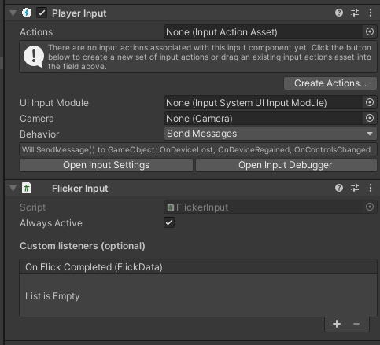
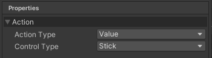
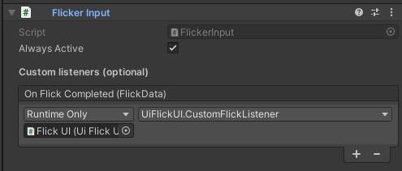
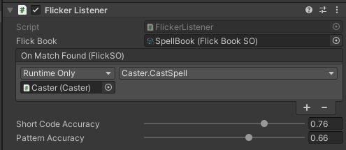
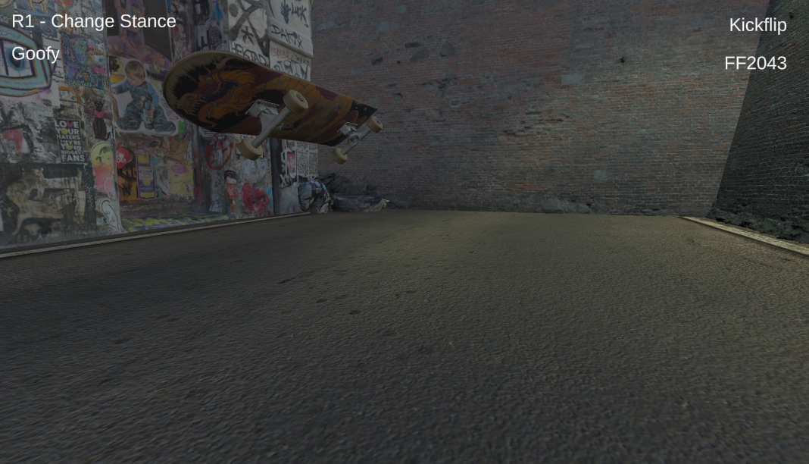

# Flicker

Flicker is a tool to provide a coded output for analogue stick movements. Differentiation is made between sweeping movements around the perimeter of the input and flicks from one edge to another. movement is encoded into an output as below:
```yaml
SW: Clockwise sweeping motion
SC: Counter clockwise sweeping motion
FF: Flick motion
```


(x , y) </br>
(-1 , 0) sweep -> (0 , -1), (0 , -1) Flick -> (0 , 1) </br>

becomes </br>

'SC0220FF2024'

## About
Flicker requires the Unity Input package.

Flicker provides a component to find the best match for the coded movement from a collection of possible 'Flicks'.

The output can also be directly used how ever you would like by utilising the custom listener on the Flicker input component.

Flicker contains a base Scriptable object called ```FlickSO```. This provides a data structure to use with the flicker listener, this will allow use of the built in match finding to output the best match from the stick input.

```c#
public abstract class FlickSO : ScriptableObject
{
    public FlickDataSO flickDataSO;
}
```

The patterns can be stored in the ```FlickDataSO``` to allow use across any assets based on the ```FlickSO``` class.

## Getting started
- Create a Flick Input component, this will also add a Unity Input manager.



- Create an input asset.

- Create an analogue stick action in the input asset.



- Set the input manager to use unity actions

- Assign the Flicker listener to the analogue stick event and assign the OnInput function.

### Creating a Flick

- Create a FlickDataSO scriptable object then name it as the pattern.
- The FlickDataSO will assign the  shortcode and pattern from the assets name:

```yaml
shortCode: SCFF
pattern: SC0220FF2024
```

- Create a ```FlickSO``` scriptable asset and assign the required FlickDataSO.

- you can create a scriptable object which extends the FlickSO class to add any addition data or functionality.

### Using the Flicker input event

- The Flicker ```OnFlickCompleted``` event will provide a string when an analogue stick movement is performed.



### Using the Flicker listeners
- To directly use the inbuilt pattern matching with FlickSO scriptable assets you can utilise the Flicker Listeners.

- Add the Flicker listener to a game object, on awake the Flicker Input component will subscribe all Flicker Listeners to the OnFlick event. If necessary this can also be done manually.

- Create a ```FlickbookSO``` scriptable object and assign it to the listener.

- The flick book can be filled with any scriptable objects which derive from FlickSO so long as they are all of the same type.

- The OnMatchFound event on the Flicker Listener will provide the FlickSO which best matches the pattern output from the Flicker Input.

- To use the output any function which accepts a FlickSO as the argument can be assigned to the OnMatchFound event.

- The accuracy of the match for the Flicker Listener can be adjusted using the sliders on the Flicker Listener components.



- As custom Flicks extend from the ```FlickSO``` you can simply cast the received ```FlickSO``` to your custom flick class in the function assigned to the ```OnMatchFound``` event:

```c#
public void CastSpell(FlickSO flickSO)
{
     SpellSO spell = (SpellSO)flickSO;
     Instantiate(spell.particles, particleEmitter);
}
```


### Demo scene
For an example implementation of the Flicker system please open the demo scene provided.


